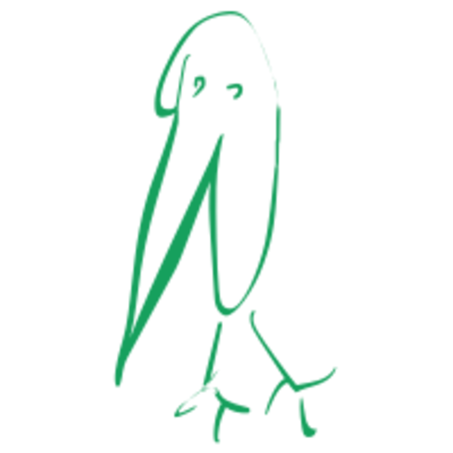
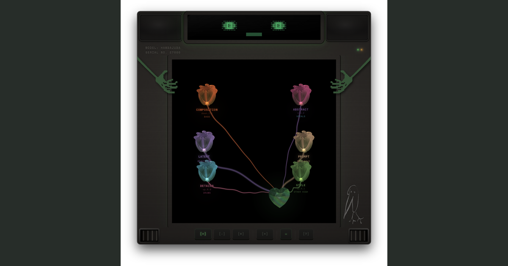
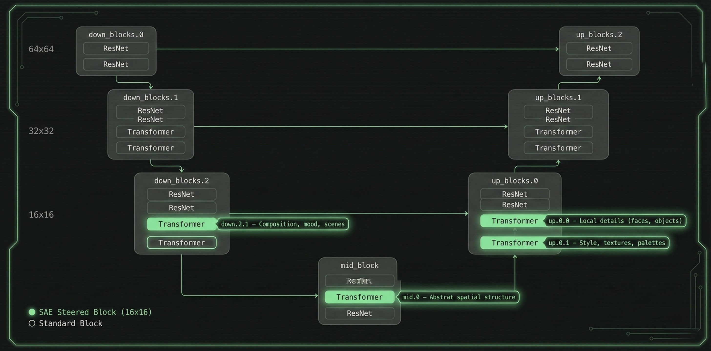
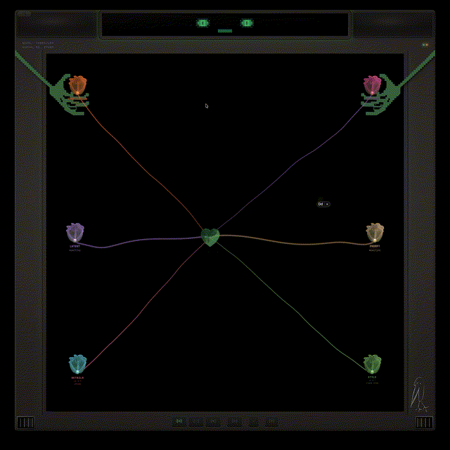
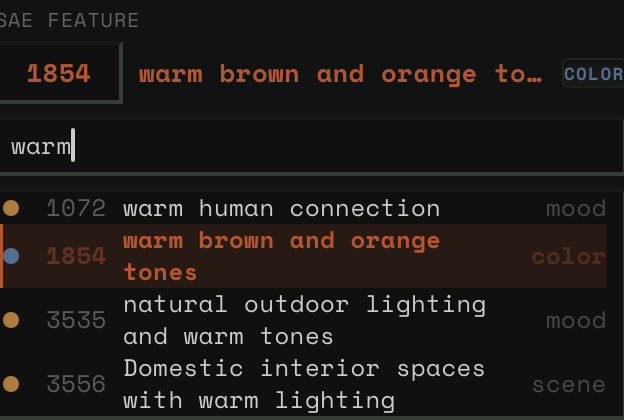
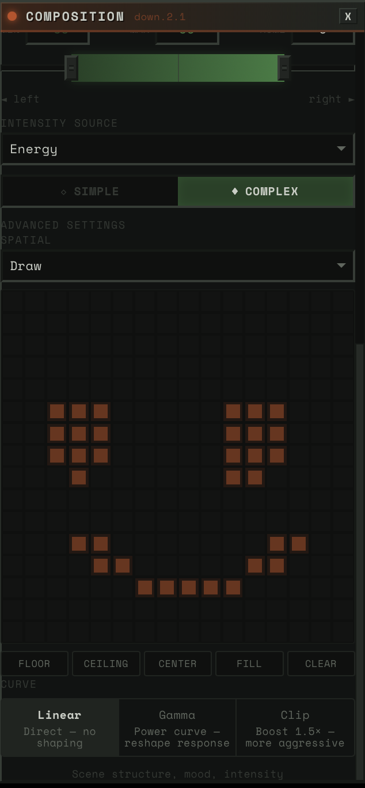
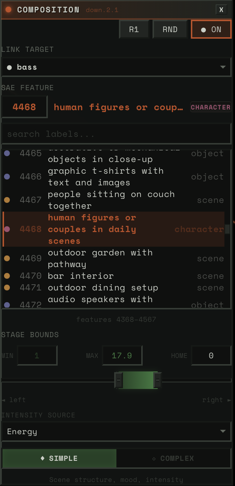

# latent-dance

<p align="center">
  
</p>

<p align="center">
  <strong>Real-time, audio-reactive SDXL-Turbo driven through interpretable diffusion-model features.</strong>
</p>

<p align="center">
  <a href="https://www.youtube.com/watch?v=g_y9-ogzzao">Full demo</a>
  ·
  <a href="https://www.youtube.com/watch?v=OOtSUKUOLHM">Teaser</a>
  ·
  <a href="https://huggingface.co/datasets/hammamiomar/sdxl-turbo-sae-labels">Hugging Face labels</a>
  ·
  <a href="docs/LABELING_PIPELINE.md">Labeling pipeline</a>
</p>

<p align="center">
  <a href="https://www.youtube.com/watch?v=g_y9-ogzzao">
    
  </a>
</p>

latent-dance is a music visualizer where the music does not drive bars,
waveforms, or shaders directly. It drives concepts inside SDXL-Turbo.

Audio is separated into stems, converted into perceptual control signals, and
mapped onto sparse autoencoder features inside four SDXL-Turbo UNet attention
blocks. The result is an instrument for performing inside a generative model:
drums can push intensity, bass can steer warmth, vocals can move detail through
the frame, and scene transitions can follow harmonic tension.

The current demo target is a single CUDA GPU. The original performance target
was about 50 FPS at 512x512 on an RTX 5090 using a compiled SDXL-Turbo path.

## What Makes It Different

- **Interpretable steering, not prompt spam.** Each visual control is a labeled
  SAE feature such as mood, texture, composition, object detail, or palette.
- **Audio as a performance interface.** Stems, pitch, transients, novelty,
  roughness, tension, beat grids, and cross-stem coupling become real-time
  control signals.
- **Spatial concept painting.** SAE features can be applied to a 16x16 spatial
  mask, so a stem can affect only the floor, center, border, or a hand-painted
  region of the image.
- **Compiled one-step diffusion.** The runtime path bypasses diffusers'
  high-level pipeline call and keeps per-frame mutation in CUDA-graph-friendly
  buffers.
- **Published feature labels.** The public dataset labels 20,480 SDXL-Turbo SAE
  features across four attention blocks.

## System At A Glance

| Area | Current public release |
|---|---|
| Generator | SDXL-Turbo, 1-step inference, 512x512 |
| Steering substrate | SDXL-Turbo SAEs from Surkov et al. / EPFL `sdxl-unbox` |
| Steered blocks | `down.2.1`, `mid.0`, `up.0.0`, `up.0.1` |
| Feature labels | 20,480 public labels on Hugging Face |
| Spatial resolution | 16x16 SAE activation maps |
| Audio analysis | Demucs stems, virtual sub-bands, perceptual DSP, beat and pitch features |
| Runtime transport | FastAPI/WebSocket, TurboJPEG frame delivery, React/R3F frontend |
| Public artifact path | `surokpro2/sdxl-saes` for upstream weights; `hammamiomar/sdxl-turbo-sae-labels` for labels |

## Demo Videos

- **Full demo:** https://www.youtube.com/watch?v=g_y9-ogzzao
- **Teaser:** https://www.youtube.com/watch?v=OOtSUKUOLHM

GitHub does not embed YouTube iframes, so the image above links to the full
demo.

## Architecture

```text
Audio upload
  -> Demucs stems + virtual sub-bands
  -> offline perceptual DSP, beat grid, pitch, roughness, novelty, coupling
  -> O(1) runtime sampler
  -> physics / spatial masks / prompt destinations / noise composition
  -> four SAE-steered SDXL-Turbo attention blocks
  -> TinyVAE decode + GPU-to-CPU copy
  -> TurboJPEG encode + WebSocket delivery
  -> React/R3F desktop-style instrument
```

All expensive audio analysis happens once at upload. Runtime work is array
lookup, lightweight physics, prompt/noise interpolation, buffer updates, and
compiled image generation.

<p align="center">
  
</p>

The four green attention blocks are where SAE directions are injected. Each
block has a different visual role:

| Block | Role |
|---|---|
| `down.2.1` | Composition, mood, global scene structure |
| `mid.0` | Abstract spatial structure |
| `up.0.0` | Local details, faces, objects |
| `up.0.1` | Style, texture, palettes |

## The Instrument

The frontend treats the model like a playable stage. Each UNet block is a flower
orb. Audio stems connect to blocks through tendrils. A crystal heart carries
the generated image state. The user can drag orbs, assign stems, search feature
labels, paint spatial masks, and crossfade between prompt destinations while
the system is running.

<p align="center">
  
</p>

### Feature Search

Each block exposes roughly 5,120 labeled features. Search by concept, browse
neighborhoods around a feature, or jump directly by feature ID.

<p align="center">
  
</p>

### Spatial Steering

The spatial mask is a 16x16 grid that multiplies steering strength per patch.
It supports presets like floor, ceiling, center, fill, and custom painted masks.

<p align="center">
  
</p>

### Block Configuration

Each block maps an audio source to a feature and a stage range. Energy,
transients, flux, pitch, brightness, or tension can determine where the visual
state moves and how far from home it travels.

<p align="center">
  
</p>

## Technical Highlights

At 50 FPS, the frame budget is 20 ms. The target breakdown from the technical
writeup is:

```text
Steering computation:                                  ~1.5 ms
Spatial mask + prompt SLERP + noise lookup:            ~0.7 ms
GPU inference:                                        ~14.0 ms
Device-to-host copy:                                   ~0.8 ms
JPEG encode, overlapped in background thread:          ~1.5 ms
```

The important systems decisions:

- **One-step SDXL-Turbo.** Scheduler logic collapses to a fixed sequence of
  tensor operations suitable for capture.
- **No Python hooks in the hot path.** Forward hooks break `torch.compile`; the
  steered attention blocks are wrapped as pure tensor modules.
- **In-place state mutation.** Per-frame values use `copy_()` and `fill_()` into
  stable buffer addresses so CUDA graphs remain valid.
- **Two-tier steering dispatch.** Feature direction changes are rare; scalar
  strength updates happen every frame.
- **Offline audio.** Demucs, pitch tracking, novelty, roughness, beat grids, and
  coupling are precomputed. Runtime sampling is interpolation.
- **Ruthless delivery.** Late frames are dropped rather than queued, because
  audio-visual sync matters more than nominal frame count.

## Feature Labeling

The SDXL-Turbo sparse autoencoders used here were trained and released by
Surkov et al. / EPFL through `sdxl-unbox`. latent-dance does **not** claim to
have trained those SAEs.

This project contributes labels and activation-analysis tooling for those
upstream SAE features:

- 50K SDXL-Turbo images generated with SAE activation logging.
- Block-specific feature ranking: global mean for composition, local maxima for
  details, summed activation for texture/style.
- VLM ensemble labeling through OpenRouter.
- Spatial heatmap analysis for abstract `mid.0` features.
- TF-IDF prompt analysis as a free statistical signal.
- Fused public labels for all 20,480 features.

The public dataset is here:

```text
https://huggingface.co/datasets/hammamiomar/sdxl-turbo-sae-labels
```

The reproducibility code is included, but Modal is optional:

```bash
uv sync --extra labeling-modal
modal setup
uv run python -m hambajuba2ba.labeling.stage1_generate --n-images 50000
```

See [docs/LABELING_PIPELINE.md](docs/LABELING_PIPELINE.md) for the full method
and attribution boundary.

## Quick Start

Prerequisites:

- Python 3.11+
- `uv`
- Bun 1.3.5+
- Node 20.19+
- CUDA GPU for real-time generation

```bash
uv sync --extra audio-gpu
cd frontend
bun install
bun run build
```

Download or verify public SAE artifacts:

```bash
uv run python scripts/artifacts/download_sae_weights.py --check
```

Run the API server:

```bash
MODE=api uv run --extra audio-gpu uvicorn app.main:app --host 0.0.0.0 --port 8000
```

Run the frontend locally during development:

```bash
cd frontend
bun dev
```

## Tests

```bash
uv run --frozen ruff check
uv run --frozen pytest -q
cd frontend
bun run build
bun run test:run
bun run lint
```

## Public Release Status

This repository is the cleaned public release tree. Private notes, personal GPU
deployment workflows, research PDFs, and heavyweight SAE checkpoint files are
intentionally excluded.

Runtime artifacts are hosted on Hugging Face:

- SAE feature-label dataset: https://huggingface.co/datasets/hammamiomar/sdxl-turbo-sae-labels
- Runtime SAE weights: https://huggingface.co/surokpro2/sdxl-saes/tree/main

## Repository Layout

- `app/` - FastAPI server, WebSocket routing, upload endpoints, generation lifecycle
- `src/hambajuba2ba/` - audio, bridge, config, generation, SAE, and labeling modules
- `frontend/` - React/R3F visual interface
- `desktop/` - Electrobun desktop wrapper
- `scripts/artifacts/` - Hugging Face artifact download helpers
- `scripts/release/` - public-release audit helpers
- `docs/` - artifact, attribution, deployment, labeling, and release notes
- `data/sdxl/features.json` - compact hand-picked runtime feature metadata
- `frontend/public/data/features/` - compact frontend feature-label tables

## Limitations

- The demo target is currently a high-end CUDA GPU.
- Output is currently optimized around 512x512 SDXL-Turbo.
- Feature labels are useful steering handles, not ground truth ontology.
- Some low-confidence labels remain, especially in subtle texture/style regions.
- Spatial steering is powerful but block-dependent; combining masks across
  multiple blocks can produce nonlinear interactions.

## Licensing

latent-dance source code is released under the PolyForm Noncommercial License
1.0.0. Commercial use requires separate permission from the author.

The public Hugging Face label dataset is currently tagged MIT. Upstream models
and checkpoints retain their own licenses. See [NOTICE](NOTICE) and
[docs/ATTRIBUTION.md](docs/ATTRIBUTION.md) before reusing artifacts.

## Acknowledgments

Built on SDXL-Turbo, Demucs, Diffusers, Torch, TurboJPEG, Electrobun, and the
SDXL-Turbo SAE work from Surkov et al. / EPFL (`sdxl-unbox`).

Key references and related work:

- Surkov et al. / EPFL, `sdxl-unbox`: https://sdxl-unbox.epfl.ch/
- Goodfire, Painting with Concepts: https://www.goodfire.ai/research/painting-with-concepts
- StreamDiffusion v2: https://streamdiffusionv2.github.io/
- Overworld Engine: https://github.com/Overworldai/world_engine
- SDXL-Turbo: https://huggingface.co/stabilityai/sdxl-turbo
- Demucs: https://github.com/facebookresearch/demucs
- Basic Pitch: https://github.com/spotify/basic-pitch
- PESTO: https://github.com/SonyCSLParis/pesto

See [docs/ATTRIBUTION.md](docs/ATTRIBUTION.md) for the detailed attribution and
license matrix.
